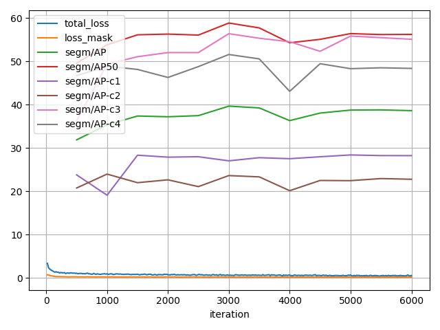
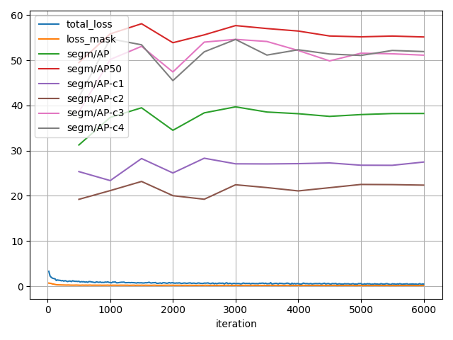

# NYCU Computer Vision 2025 Spring HW3

**StudentID:** 111550135  
**Name:** 林李奕

---

## Introduction

This repository contains my HW3 solution for NYCU Computer Vision 2025 Spring.  
We tackle **instance segmentation of cell images** using a Mask R-CNN based pipeline.  
Key elements:

- **Backbone:** ResNeXt-101 + FPN (pretrained on COCO).  
- **Custom anchors:** `[8,16,32,64,128]` with aspect ratios `[0.5,1.0,2.0]`.  
- **Test-time augmentation (TTA):** horizontal / vertical flips.  
- **Ensemble:** Weighted Box Fusion (WBF) over two flip models.

---

## How to run (on Kaggle)

1. Upload this repo to a new Kaggle Notebook.  
2. Place the released data under `/kaggle/input/hw3-data/hw3-data-release`.  
3. Open and run `111550135.ipynb` from top to bottom.  
   - No `requirements.txt` needed.

---

## Configurations

| Model ID          | Random Flip | Test AP50 |
|-------------------|-------------|----------------------|
| **0320_18**       | vertical    | 0.5625               |
| **0322_19**       | horizontal  | 0.5739               |
| **WBF‐Ensemble**  | both        | **0.5809**           |

---

## Performance snapshot

| Model              | Public Test AP50 |
|--------------------|------------------------------|
| 0320_18 (vertical)  | 0.5625                       |
| 0322_19 (horizontal)| 0.5739                       |
| Ensemble (WBF)      | **0.5809**                   |

  
 
 
---

## Additional experiment: Ensembling via WBF

We fused the two models’ box & mask predictions with **Weighted Box Fusion**.  
Hypothesis: combining complementary views (vertical & horizontal) boosts recall and IoU agreement.  
Result: test AP50 improved from 0.5739 → 0.5809.

---
